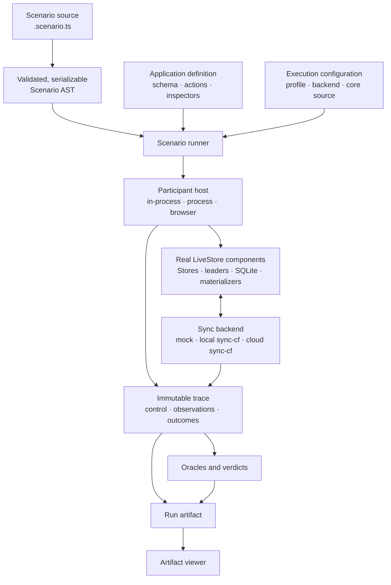

# LiveStore scenario runner

The scenario runner turns distributed sync stories into repeatable evidence. A
scenario describes Clients, sessions, actions, failures, and the properties that
should hold. The same scenario can run in-process, in isolated Node processes,
or in real browser contexts and then be inspected in the artifact viewer.

## Quick start

Prepare a fresh checkout from the repository root:

```sh
devenv shell
mr apply
devenv tasks run pnpm:install --mode before
```

Run the default scenario:

```sh
pnpm --dir tests/scenarios scenario:run
```

The run writes a replayable artifact to
`tests/scenarios/artifacts/<scenario-id>.json`. In another terminal, start the
viewer:

```sh
pnpm --dir tests/scenarios viewer
```

Open the printed URL, normally <http://localhost:5173>, and select the run from
**Saved runs**.

Use `pnpm --dir tests/scenarios scenario:run --help` to list every retained
scenario and command-line option.

## The mental model

Three inputs define a run:

- a **Scenario** describes topology, ordered instructions, faults, annotations,
  and expected properties;
- an **Application** supplies a real LiveStore schema, typed actions,
  materializers, and State inspectors; and
- the **execution configuration** chooses where participants run and which sync
  backend they use.



The runner deliberately keeps three kinds of information separate:

| Layer    | Question                     | Meaning                                                                                       |
| -------- | ---------------------------- | --------------------------------------------------------------------------------------------- |
| Control  | What did the runner ask for? | An acknowledgement means the host handled a request; it does not prove product state changed. |
| Evidence | What was observed?           | Component observations, operation outcomes, recovery, and settlement are retained as facts.   |
| Claim    | What can we conclude?        | Oracles evaluate retained evidence and emit explicit verdicts.                                |

The artifact is authoritative. The viewer derives topology, history, flow, and
time projections from that immutable artifact; it does not inspect a live run or
change its verdict.

## Choose how to run

The scenario source stays the same across compatible profiles. Changing the
profile moves the participant boundary and changes what the run can prove.

| Profile      | Participant placement                                              | Default backend | Best for                                                         |
| ------------ | ------------------------------------------------------------------ | --------------- | ---------------------------------------------------------------- |
| `in-process` | Real Stores and processors inside the controller process           | Controlled mock | Fast correctness checks, stress, and deterministic boundaries    |
| `process`    | One isolated Node child process per Client                         | Local `sync-cf` | Process isolation, lifecycle, and the serialized host boundary   |
| `browser`    | One persistent browser context per Client and one page per session | Local `sync-cf` | OPFS, SharedWorkers, Web Locks, persistence, and the web adapter |

Common runs from the repository root:

```sh
# Fast default: offline-writer-recovery, in-process, controlled mock backend
pnpm --dir tests/scenarios scenario:run

# Run a retained case by name
pnpm --dir tests/scenarios scenario:run --scenario multi-session-recovery

# Exercise the real local sync-cf stack in Chromium
pnpm --dir tests/scenarios scenario:run --profile browser

# Watch the browser run
SCENARIO_BROWSER_HEADLESS=0 pnpm --dir tests/scenarios scenario:run --profile browser

# Override a declared Scenario parameter
pnpm --dir tests/scenarios scenario:run --scenario many-writer-convergence --set event_count=100
```

For selecting another LiveStore checkout or Git revision, cloud execution,
artifact controls, Storybook, and focused test commands, see
[Running and inspecting scenarios](./RUNNING.md).

## Author a scenario

Start with the ignored local template so exploratory work does not enter Git:

```sh
cp tests/scenarios/local/scenarios/scenario-template.scenario.ts \
  tests/scenarios/local/scenarios/my-investigation.scenario.ts

pnpm --dir tests/scenarios scenario:run \
  --scenario-file local/scenarios/my-investigation.scenario.ts
```

A Scenario is a trusted TypeScript module with immutable ordered steps and
optional terminal expectations:

```ts
export default Scenario.start({
  application: todo,
  about: 'Client A writes offline, reconnects, and converges.',
  clients: [clientA, clientB],
})
  .steps(
    disconnect(clientA),
    todo.createTodo({ id: 'offline', text: 'Written offline' }).as(sessionA),
    reconnect(clientA),
  )
  .expect(pendingResolved(both), eventlogsConverge(both))
```

Normal TypeScript handles loops, branches, parameters, generated actions, and
reusable helpers. Before execution, the source is evaluated and normalized into
closed, validated data; no callback or module reference crosses into a
participant host or artifact.

Read [TypeScript Scenario authoring](./SCENARIO_AS_CODE.md) for the complete
construct reference and [local/scenarios](./local/scenarios) for the investigation
and promotion workflow.

## Where to go next

| Goal                                                            | Document                                                                                                                               |
| --------------------------------------------------------------- | -------------------------------------------------------------------------------------------------------------------------------------- |
| Select core source, configure cloud sync, or run focused checks | [Running and inspecting scenarios](./RUNNING.md)                                                                                       |
| Learn every Scenario authoring construct                        | [TypeScript Scenario authoring](./SCENARIO_AS_CODE.md)                                                                                 |
| Understand why the evidence model is shaped this way            | [Scenario verification intuition](../../context/verification/scenarios/intuition.md)                                                   |
| See the architecture and evidence model visually                | [Scenario runner visual explainer](../../context/verification/scenarios/scenario-runner-explainer.html)                                |
| Read the normative realization contract                         | [Requirements](../../context/verification/scenarios/requirements.md) and [specification](../../context/verification/scenarios/spec.md) |
| Run adversarial campaigns and reduce failures                   | [Red-team plan](./RED_TEAMING.md)                                                                                                      |
| Review known sync failures and exact reproductions              | [Sync correctness findings](./SYNC_CORRECTNESS_FINDINGS.md)                                                                            |

`tests/scenarios` is private contributor tooling. It may depend on LiveStore
product packages, but product packages never depend on the runner.
